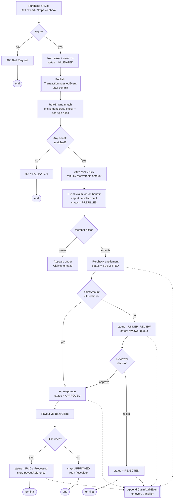
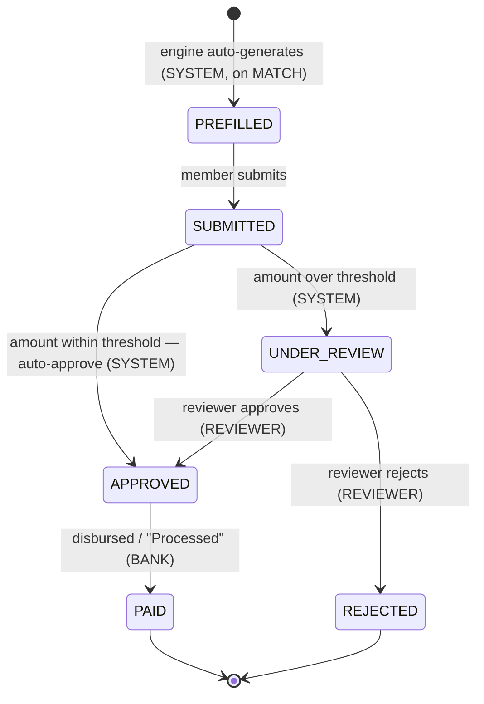
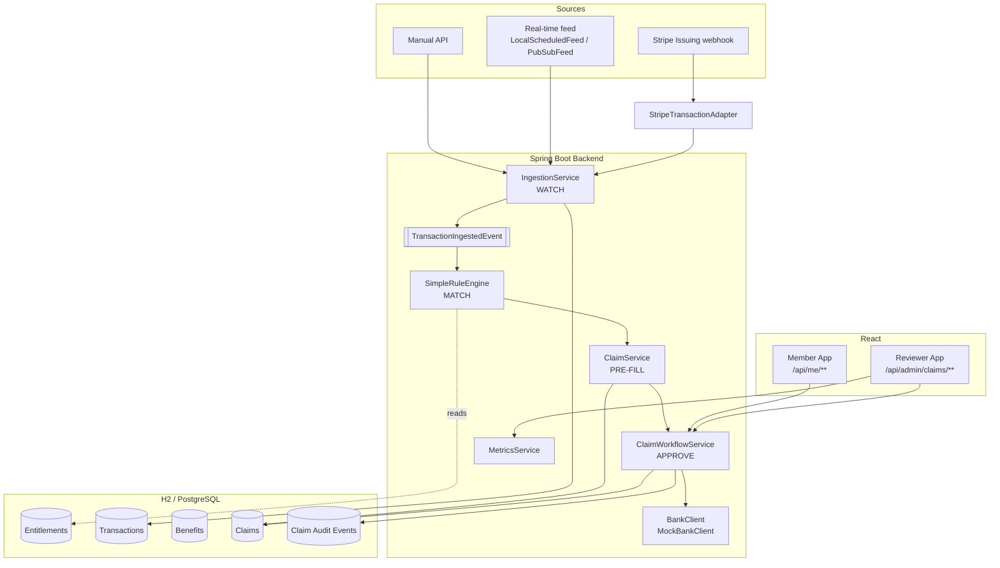

# RewardHub - Card Benefit Activation Engine

> **Never leave a benefit you've paid for unclaimed.**

Most card members are unaware of — or simply forget to claim — the insurance and protection
benefits already built into their credit cards. Purchase protection, return protection, and
travel-delay insurance quietly go unused, so people leave real money on the table.

The **Card Benefit Activation Engine** closes that gap. It **watches** every purchase,
**matches** it to the right protection benefit, **pre-fills** a ready-to-submit claim, and
drives it through a full submission and **approval** workflow — so a card member only has to
review and tap *Submit*.

*· Spring Boot 4 (Java 21) + React*

---

## Table of Contents

1. [Why This Matters](#why-this-matters)
2. [How It Works](#how-it-works)
3. [End-to-End Flow](#end-to-end-flow)
4. [Feature Tour](#feature-tour)
5. [Tech Stack](#tech-stack)
6. [Architecture](#architecture)
7. [Running the Project](#running-the-project)
8. [API Reference](#api-reference)
9. [Configuration](#configuration)
10. [Seed Data](#seed-data)
11. [Testing](#testing)
12. [Design Decisions](#design-decisions)
13. [What's Real vs. Simulated](#whats-real-vs-simulated)
14. [Project Layout](#project-layout)

---

## Why This Matters

Think of a credit card as a backpack with hidden "magic pockets" most people never open:

| Benefit | What it does                                                                            |
|---------|-----------------------------------------------------------------------------------------|
| 🛡️ **Purchase Protection** | Claims protection over an eligible purchase that is damaged or stolen.                  |
| 📦 **Return Protection** | Claims rerturn protection over an eligible item when a merchant refuses a valid return. |
| ✈️ **Travel-Delay Insurance** | Covers expenses when covered travel is delayed beyond a threshold.                      |

**The problem:** members don't know these pockets exist, so the value sits unused — and issuers
struggle to prove ROI on benefits that are never claimed.

**The value:** members recover money they've already paid for, perceived card value rises, and
engagement and retention improve.

> This is **not** a rewards or loyalty program. The focus is entirely on the *unused insurance
> and protection* side of card benefits.

---

## How It Works

```
WATCH 👀  →  MATCH 🔍  →  PRE-FILL 📝  →  APPROVE 🏦
```

1. **WATCH** — Ingest and validate every incoming purchase (manual API, real-time feed, or
   Stripe webhook — all through one funnel).
2. **MATCH** — Cross-check the card's entitlements and apply per-benefit rules to decide which
   protection (if any) covers the purchase.
3. **PRE-FILL** — Auto-build a `PREFILLED` claim with every field populated from the transaction.
4. **APPROVE** — Run the claim through an enforced state machine: submit → auto-approve or
   route to a reviewer → disburse, with an immutable audit trail at every step.

---

## End-to-End Flow



### Claim lifecycle (state machine)



---

## Feature Tour

### 👀 WATCH — Ingestion (`IngestionService`)
- **Single ingestion funnel:** manual REST calls, the scheduled feed, and the Stripe webhook all
  converge on `IngestionService.ingest(...)`, so behavior is identical regardless of source.
- **Validation + normalization** on every purchase (e.g. card-product casing) before it's saved
  as `VALIDATED`.
- **Event-driven detection:** ingestion publishes a `TransactionIngestedEvent`; matching runs on
  `@TransactionalEventListener(AFTER_COMMIT)` in a fresh transaction — a thin write path and a
  seam ready for a real message broker.

### 🔍 MATCH — Rule Engine (`SimpleRuleEngine` behind `RuleEngine`)
- **Entitlement-first:** only benefits the card product actually holds can ever match.
- **Per-benefit rules:** category + coverage-window checks for purchase/return protection; an
  event-based rule for travel-delay (no days-from-purchase window).
- **Ranking:** matches are ordered by estimated recoverable amount — `min(amount, perClaimLimit)`
  — so the most valuable benefit is offered first.
- **Handles no-match and multiple-match** cleanly. Qualifying categories are **externalized to
  `application.yml`** and editable with zero code changes.

### 📝 PRE-FILL — Claim Generation (`ClaimService`)
- Builds a `Claim` auto-populated from the transaction + matched benefit, saved as `PREFILLED`.
- **Idempotent per `(transaction, benefit)`** — replays and retries never create duplicate claims.
- Claim amount is **capped at the per-claim limit**; pre-fill completeness is verified.

### 🏦 APPROVE — Workflow (`ClaimWorkflowService`)
- **Enforced state machine:** legal transitions are declared on the `ClaimStatus` enum; illegal
  moves throw and return **409**, making invalid states unrepresentable via the API.
- **Auto-decision:** claims at or below the configured threshold auto-approve on submit; larger
  ones route to manual review.
- **Entitlement re-checked on submit** — a revoked benefit throws `ClaimNotEntitled` (409).
- **Payout** delegates to a `BankClient` interface (`MockBankClient` in the prototype) and moves
  the claim to `PAID` with a payout reference.
- **Append-only audit trail:** every transition records who / what / why (`SYSTEM`, `REVIEWER`,
  `BANK`).

### 📊 METRICS (`MetricsService`)
- `GET /api/metrics` reports purchases ingested, matched, **detection rate %**, total detectable
  value, claimed value, processed/paid value, still-unclaimed value, and the headline
  **% reduction in unclaimed benefits**.

### 🖥️ Two React UIs, one JWT-secured API
- **Member app** — "Claims to make" (pre-filled) vs. "Submitted claims" with live status tracking
  and one-tap submit.
- **Reviewer app** — review queue (approve/reject with a reason), multi-filter search across all
  customers, and a live metrics dashboard.

---

## Tech Stack

| Layer | Technology |
|-------|------------|
| Runtime | **Spring Boot 4.1.0** on **Java 21** |
| Web / API | Spring Web MVC (REST) |
| Data access | Spring Data JPA + Hibernate |
| Database | H2 in-memory (demo) → PostgreSQL (prod-ready) |
| Validation | Jakarta Bean Validation |
| Security | Spring Security + JWT (`jjwt` 0.12.6) |
| API docs | springdoc OpenAPI / Swagger UI |
| Boilerplate | Lombok |
| Build | Maven (wrapper included) |
| Testing | JUnit 5 + Mockito + Spring Security Test |
| Frontend | React 18 + Vite 5 |
| Integration resources | Stripe Issuing (data source) · Google Pub/Sub (transport) · AWS Lambda (optional serverless matching) |

---

## Architecture



**Core principle:** every external dependency (data source, transport, bank, compute) sits behind
an **interface/adapter** — `RuleEngine`, `BankClient`, `TransactionFeed`. The offline demo runs
the *real* code path; only the external endpoints are swapped via configuration.

---

## Running the Project

### Prerequisites
- **JDK 21+**
- **Node.js 18+** (only if you want to develop the frontend separately)

### Option A — One command (backend serves the pre-built UI)

The production frontend build is emitted into `src/main/resources/static`, so the backend serves
both the UI and the API on a single port:

```bash
# Windows
mvnw.cmd spring-boot:run

# macOS / Linux
./mvnw spring-boot:run
```

Then open:

| URL | What |
|-----|------|
| `http://localhost:8080` | React UI (login as a card member, or `admin` for the reviewer) |
| `http://localhost:8080/swagger-ui.html` | Interactive API docs |
| `http://localhost:8080/h2-console` | H2 database console (JDBC URL `jdbc:h2:mem:benefitdb`) |
| `http://localhost:8080/actuator/health` | Health check |

### Option B — Frontend dev server (hot reload)

Run the backend as above, then in a second terminal:

```bash
cd frontend
npm install
npm run dev          # Vite dev server on http://localhost:5173
```

The Vite dev server proxies `/api` calls to `:8080`, so the browser only ever talks to one origin
(no CORS setup needed).

To rebuild the UI into the backend's static folder:

```bash
cd frontend
npm run build        # outputs to ../src/main/resources/static
```

### Logging in (demo identity)
- Enter **any** card member id (e.g. `CM-1001`) to sign in as a **card member**.
- Enter **`admin`** to sign in as a **reviewer**.

> These are demo identity tokens for the prototype, **not** password-based authentication.

### Trying it out end-to-end

**As a card member (e.g. `CM-1001`):**
- Land on **"Claims to make"** — the pre-filled claims the engine generated for that member's
  matched purchases.
- Review a claim and tap **Submit**. Claims **at or below $700** are **auto-approved (and paid)**
  instantly; anything **above $700** is routed to a reviewer.
- Track everything under **"Submitted claims"** with its live status.

**As the reviewer (`admin`):**
- Open the **review queue** to see claims **over $700** waiting for a decision.
- **Approve** (which disburses the payout) or **Reject** with a reason.
- Use **Search** to filter claims across all customers, and the **Dashboard** for live metrics.

### Where the transactions come from

- **Automatic feed (default):** a built-in seeder/feed (`LocalScheduledFeed`) **drips a simulated
  purchase every 5 seconds** the moment the app starts, so matched benefits and pre-filled claims
  appear on their own — no setup needed. Pause/resume it via `POST /api/admin/feed`, or turn it
  off with `feed.type: none` in `application.yml`.
- **Manual entry via Swagger:** open `http://localhost:8080/swagger-ui.html` and use
  **`POST /api/transactions`** to add your own purchase (amount, merchant, category, card product,
  date). It flows through the exact same pipeline — the engine matches it and pre-fills a claim
  that shows up for the matching card member.

---

## API Reference

Base path: `http://localhost:8080`

| Method | Endpoint | Auth | Purpose |
|--------|----------|------|---------|
| `POST` | `/api/auth/login` | public | Issue a JWT (`admin` → reviewer, else card member) |
| `POST` | `/api/transactions` | public | Ingest a purchase (WATCH) |
| `GET`  | `/api/transactions` | public | List ingested purchases |
| `POST` | `/api/stripe/webhook` | public | Receive Stripe-style authorization events |
| `GET`  | `/api/benefits/{transactionId}` | public | Matched benefits for a purchase (MATCH) |
| `GET`  | `/api/claims` · `/api/claims/{id}` | public | List / view claims |
| `GET`  | `/api/me/claims?status=PREFILLED` | **CARD_MEMBER** | The member's own claims |
| `POST` | `/api/me/claims/{id}/submit` | **CARD_MEMBER** | Submit one of my pre-filled claims |
| `GET`  | `/api/admin/claims` | **REVIEWER** | Search claims across all customers |
| `POST` | `/api/admin/claims/{id}/decision` | **REVIEWER** | Approve / reject a claim |
| `GET`  | `/api/entitlements` | public | List card entitlements |
| `GET`  | `/api/metrics` | public | Detection & unclaimed-reduction metrics |
| `POST` | `/api/admin/feed` | public | Pause / resume the demo feed |

Protected endpoints expect an `Authorization: Bearer <token>` header. A missing or invalid token
returns **401**; the correct role but wrong ownership returns **403**.

---

## Configuration

Key settings in `src/main/resources/application.yml`:

```yaml
feed:
  type: local-scheduled     # local-scheduled | pubsub | none
  local:
    interval-ms: 5000        # emit a simulated purchase every 5s
    initial-delay-ms: 5000
    start-paused: false

matching:                    # which merchant categories qualify each benefit
  categories:
    PURCHASE_PROTECTION: [ELECTRONICS, APPLIANCES]
    RETURN_PROTECTION:   [APPAREL, DEPARTMENT_STORE, ELECTRONICS]
    TRAVEL_DELAY:        [AIRLINE, LODGING, TRAVEL_AGENCY]

workflow:
  auto-approve-threshold: 700.00   # claims at/below this auto-approve; above → manual review

auth:
  jwt:
    secret: ${AUTH_JWT_SECRET:change-me-...}   # override via env in real deployments
    expiry-minutes: ${AUTH_JWT_EXPIRY_MINUTES:120}
```

---

## Seed Data

`DataSeeder` populates the benefits catalog and entitlements on first startup (idempotent — it
only runs when the benefit table is empty).

**Benefits catalog**

| Benefit | Per-claim limit | Coverage window |
|---------|-----------------|-----------------|
| Purchase Protection | $1,000 | 90 days |
| Return Protection | $300 | 90 days |
| Travel-Delay Insurance | $500 | event-based |

**Entitlements by card product**

| Card | Purchase | Return | Travel-Delay |
|------|:--------:|:------:|:------------:|
| PLATINUM | ✓ | ✓ | ✓ |
| GOLD | ✓ | ✓ | — |
| GREEN | ✓ | — | — |

---

## Testing

Run the full suite:

```bash
./mvnw test        # or mvnw.cmd test on Windows
```

Coverage spans every layer — JUnit 5 + Mockito:

- **Engine** — detection accuracy and ranking (`SimpleRuleEngineTest`), event-driven detection
  (`BenefitDetectionListenerTest`).
- **Services** — pre-fill quality (`ClaimServiceTest`), state-machine + illegal-transition
  rejection (`ClaimWorkflowServiceTest`), metrics (`MetricsServiceTest`).
- **Controllers** — per-member scoping (`MeClaimControllerTest`), reviewer queue/search
  (`AdminClaimControllerTest`), and a full end-to-end flow
  (`FullClaimFlowIntegrationTest`: ingest → detect → pre-fill → submit → approve).
- **Integration** — Stripe mapping (`StripeTransactionAdapterTest`), feed selection and drip
  behavior, and JPA persistence.

---

## Design Decisions

- **Event-driven decoupling** keeps the ingestion write path thin and leaves a clean seam for a
  real message broker.
- **Enforced state machine** — legal transitions live on the enum, so invalid states can't be
  reached through the API.
- **Idempotent pre-fill** makes replays and feed re-drips safe.
- **Append-only audit log** gives full traceability and also powers the reviewer "Approved"
  filter (actor `REVIEWER` → `APPROVED`).
- **Swappable seams** (`RuleEngine`, `BankClient`, `TransactionFeed`) plus config-driven rules and
  thresholds mean production wiring changes configuration, not code.
- **Security scoped narrowly** — only `/api/me/**` (card member) and `/api/admin/claims/**`
  (reviewer) are guarded; the rest of the API, Swagger, and the H2 console stay open so existing
  behavior and tests are unaffected.

---

## What's Real vs. Simulated

| Capability | Status                                                    |
|------------|-----------------------------------------------------------|
| Transaction ingestion & validation | ✅ Real                                                    |
| Benefit detection / matching | ✅ Real (unit-tested)                                      |
| Claim pre-fill | ✅ Real                                                    |
| Entitlement management | ✅ Real                                                    |
| Submission + approval state machine + audit | ✅ Real                                                    |
| Metrics | ✅ Real                                                    |
| Final approval decision + money movement | ✅ Simulated — requires Bank Access; behind `BankClient`   |
| Stripe live webhook | ✅ Simulated offline — real adapter, sample JSON in demo  |


We build the entire workflow and stop only at the point that physically requires being American
Express (a banking license and regulated payment rails) — documented behind a clean integration
interface.

---

## Project Layout

```
benefit-activation-engine/
├── src/main/java/com/amex/benefit_activation_engine/
│   ├── controller/    REST endpoints (transactions, claims, admin, auth, metrics, stripe)
│   ├── service/       IngestionService, ClaimService, ClaimWorkflowService, MetricsService
│   ├── engine/        RuleEngine + SimpleRuleEngine + BenefitDetectionListener (MATCH)
│   ├── model/         JPA entities + enums (Transaction, Benefit, Entitlement, Claim, ...)
│   ├── repository/    Spring Data JPA repositories
│   ├── integration/   stripe/ · feed/ · bank/ adapters (swappable seams)
│   ├── security/      JWT auth (JwtService, JwtAuthFilter, SecurityConfig)
│   ├── dto/           request/response payloads
│   └── config/        DataSeeder + config properties
├── src/test/java/...  JUnit 5 / Mockito test suite
├── frontend/          React 18 + Vite UI (Member app + Reviewer app)
├── docs/diagrams/     Architecture & flow diagrams (generated)
└── src/main/resources/application.yml   central configuration
```
